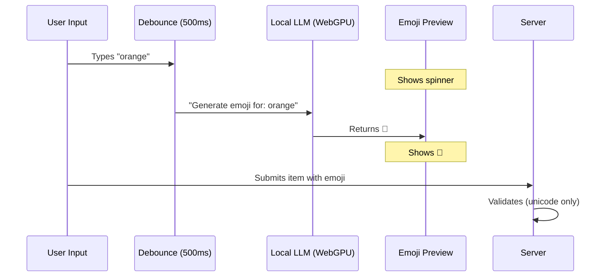

# Local LLM Emoji Classification via WebGPU

## Overview

This spec outlines a client-side emoji classification feature using a small language model running in the browser via WebGPU. The goal is to replace the current server-side Anthropic Haiku API call with a local model that runs in each user's browser, providing instant emoji suggestions while they type.

## Current Architecture

The current flow for emoji generation:

1. **User submits item** → `submit_item` WebSocket message
2. **Server calls `fetchEmoji()`** → HTTP POST to `/api/emoji`
3. **Cloudflare Worker** → Calls Anthropic Haiku API
4. **Haiku returns emoji** → Server saves item with emoji to room state

**Problems with current approach:**

- Server API calls add latency
- Anthropic API has usage limits (currently 500/day with rate limiting)
- No preview—users don't see the emoji until after submission

## Proposed Architecture

### Flow



### Key Components

1. **`EmojiLLM` Service** - Manages model loading and inference
2. **`useEmojiClassifier` Hook** - React hook with debounced inference
3. **Emoji Preview UI** - Shows spinner → emoji in input area
4. **Server Validation** - Rejects non-unicode characters

---

## Feasibility Analysis

### ✅ WebGPU Browser Support

| Browser      | Status                              |
| ------------ | ----------------------------------- |
| Chrome 113+  | ✅ Stable (desktop & Android)       |
| Edge         | ✅ Stable                           |
| Firefox 141+ | ✅ Windows stable, macOS ARM stable |
| Safari 17.4+ | ⚠️ Feature flag required            |

**Fallback:** WASM-based inference for browsers without WebGPU (slower but functional).

### Model Options

| Model                 | Size     | Speed (est.) | Quality  | Notes                               |
| --------------------- | -------- | ------------ | -------- | ----------------------------------- |
| **SmolLM-135M**       | ~250MB   | 500-1000ms   | Good     | Smallest viable LLM, ONNX available |
| SmolLM-360M           | ~700MB   | 1-2s         | Better   | Better quality, larger              |
| Phi-3-mini-4k         | ~2.3GB   | 2-4s         | Best     | Overkill for this task              |
| **Custom classifier** | ~10-50MB | 50-100ms     | Variable | Fine-tuned for emoji only           |

> [!IMPORTANT]
> For emoji classification, a **fine-tuned small classifier** (not a full LLM) may be more appropriate. A BERT-tiny model (~15MB) trained on text→emoji pairs could achieve faster inference.

### Recommended Approach

**Phase 1: SmolLM-135M with transformers.js**

- Fastest to implement
- Good quality for general text
- ~250MB download, cached after first load
- ~500ms-1s inference time

**Phase 2 (Optional): Custom Emoji Classifier**

- Fine-tune a tiny model (BERT-tiny, DistilBERT)
- Train on text→emoji dataset
- ~15-50MB, <100ms inference

---

## Technical Implementation

### Library Choice: `@huggingface/transformers`

```bash
pnpm add @huggingface/transformers
```

**Why transformers.js:**

- Official Hugging Face library
- WebGPU and WASM backends
- Automatic model caching
- Simple pipeline API
- Easy model swapping

### Core Service

```typescript
// apps/web/src/lib/emojiLLM.ts

import { pipeline, env } from '@huggingface/transformers';

// Configure for browser
env.allowLocalModels = false;
env.useBrowserCache = true;

// Model configuration - easily swappable
const MODEL_CONFIG = {
  // Current model
  model: 'HuggingFaceTB/SmolLM-135M-Instruct',
  // Alternatives to test:
  // 'Xenova/gpt2-tiny-onnx'
  // 'Xenova/distilbert-base-uncased'
  // 'Xenova/bert-base-emoji' (if available)
  quantized: true,
  useWebGPU: true,
};

class EmojiLLM {
  private pipeline: any = null;
  private loadingPromise: Promise<void> | null = null;
  private isReady = false;

  async initialize(): Promise<void> {
    if (this.loadingPromise) return this.loadingPromise;

    this.loadingPromise = (async () => {
      console.log('[EmojiLLM] Loading model...', MODEL_CONFIG.model);

      try {
        this.pipeline = await pipeline('text-generation', MODEL_CONFIG.model, {
          device: MODEL_CONFIG.useWebGPU ? 'webgpu' : 'wasm',
          dtype: MODEL_CONFIG.quantized ? 'q8' : 'fp32',
        });

        this.isReady = true;
        console.log('[EmojiLLM] Model loaded successfully');
      } catch (error) {
        console.error('[EmojiLLM] Failed to load model:', error);
        // Fall back to WASM if WebGPU fails
        this.pipeline = await pipeline('text-generation', MODEL_CONFIG.model, {
          device: 'wasm',
          dtype: 'q8',
        });
        this.isReady = true;
      }
    })();

    return this.loadingPromise;
  }

  async classifyEmoji(text: string): Promise<string> {
    if (!this.isReady) {
      await this.initialize();
    }

    const prompt = `What single emoji best represents "${text}"? Reply with just the emoji:`;

    const result = await this.pipeline(prompt, {
      max_new_tokens: 5,
      temperature: 0.1,
      do_sample: false,
    });

    // Extract emoji from response
    const response = result[0]?.generated_text || '';
    const emoji = this.extractEmoji(response);

    return emoji || '🎲';
  }

  private extractEmoji(text: string): string | null {
    // Match emoji unicode ranges
    const emojiRegex = /[\u{1F300}-\u{1F9FF}]|[\u{2600}-\u{26FF}]|[\u{2700}-\u{27BF}]/gu;
    const match = text.match(emojiRegex);
    return match?.[0] || null;
  }

  get ready(): boolean {
    return this.isReady;
  }
}

export const emojiLLM = new EmojiLLM();
```

### React Hook

```typescript
// apps/web/src/hooks/useEmojiClassifier.ts

import { useState, useEffect, useRef } from 'react';
import { emojiLLM } from '../lib/emojiLLM';

interface EmojiClassifierState {
  emoji: string | null;
  isLoading: boolean;
  isModelLoading: boolean;
  error: string | null;
}

export function useEmojiClassifier(text: string, debounceMs: number = 500): EmojiClassifierState {
  const [state, setState] = useState<EmojiClassifierState>({
    emoji: null,
    isLoading: false,
    isModelLoading: !emojiLLM.ready,
    error: null,
  });

  const timeoutRef = useRef<NodeJS.Timeout>();
  const abortRef = useRef<boolean>(false);

  useEffect(() => {
    // Clear previous timeout
    if (timeoutRef.current) {
      clearTimeout(timeoutRef.current);
    }

    // Reset if text is empty
    if (!text.trim()) {
      setState((s) => ({ ...s, emoji: null, isLoading: false }));
      return;
    }

    // Set loading state
    setState((s) => ({ ...s, isLoading: true }));
    abortRef.current = false;

    // Debounce the classification
    timeoutRef.current = setTimeout(async () => {
      try {
        const emoji = await emojiLLM.classifyEmoji(text);

        if (!abortRef.current) {
          setState({ emoji, isLoading: false, isModelLoading: false, error: null });
        }
      } catch (error) {
        if (!abortRef.current) {
          setState((s) => ({
            ...s,
            isLoading: false,
            error: 'Failed to classify emoji',
          }));
        }
      }
    }, debounceMs);

    return () => {
      abortRef.current = true;
      if (timeoutRef.current) {
        clearTimeout(timeoutRef.current);
      }
    };
  }, [text, debounceMs]);

  return state;
}
```

### Background Model Preloading

```typescript
// apps/web/src/App.tsx

import { useEffect } from 'react';
import { emojiLLM } from './lib/emojiLLM';

function App() {
  // Preload model when app starts
  useEffect(() => {
    // Use requestIdleCallback for non-blocking load
    if ('requestIdleCallback' in window) {
      window.requestIdleCallback(() => {
        emojiLLM.initialize();
      });
    } else {
      // Fallback: load after short delay
      setTimeout(() => emojiLLM.initialize(), 2000);
    }
  }, []);

  return <Routes>...</Routes>;
}
```

### UI Integration

```tsx
// In GameView.tsx - Item input with emoji preview

function ItemInput({ onSubmit }: { onSubmit: (text: string, emoji: string) => void }) {
  const [text, setText] = useState('');
  const { emoji, isLoading, isModelLoading } = useEmojiClassifier(text);

  const handleSubmit = () => {
    if (!text.trim()) return;
    onSubmit(text, emoji || '🎲');
    setText('');
  };

  return (
    <div className="flex items-center gap-2">
      <div className="w-10 h-10 flex items-center justify-center border-2 border-black">
        {isModelLoading ? (
          <span className="text-xs text-muted">...</span>
        ) : isLoading ? (
          <span className="animate-spin">⏳</span>
        ) : (
          <span className="text-2xl">{emoji || '❓'}</span>
        )}
      </div>

      <input
        type="text"
        value={text}
        onChange={(e) => setText(e.target.value)}
        placeholder="Enter something to rank..."
        className="flex-1 input"
      />

      <button onClick={handleSubmit} disabled={!text.trim()}>
        Submit
      </button>
    </div>
  );
}
```

### Server-Side Validation

```typescript
// apps/api/src/handlers/ws/submitItem.ts

function isValidEmoji(str: string): boolean {
  // Must be 1-4 unicode characters (some emojis use multiple codepoints)
  if (str.length === 0 || str.length > 8) return false;

  // Check all characters are in valid emoji ranges
  const emojiRegex =
    /^[\u{1F300}-\u{1F9FF}\u{2600}-\u{26FF}\u{2700}-\u{27BF}\u{1F600}-\u{1F64F}\u{1F680}-\u{1F6FF}\u{1F1E0}-\u{1F1FF}]+$/u;
  return emojiRegex.test(str);
}

export async function handleSubmitItem(
  message: { text: string; emoji?: string }
  // ...
) {
  const { text, emoji } = message;

  // Validate emoji if provided by client
  if (emoji && !isValidEmoji(emoji)) {
    conn.send(
      JSON.stringify({
        type: 'error',
        message: 'Invalid emoji',
        code: 'INVALID_EMOJI',
      })
    );
    return;
  }

  // Use provided emoji or fallback to server-side generation
  const finalEmoji = emoji || (await fetchEmoji(text));

  // ... rest of submission logic
}
```

---

## Hot-Swapping Models

The architecture supports easy model testing:

```typescript
// apps/web/src/lib/emojiLLM.config.ts

export const EMOJI_MODELS = {
  smolLM: {
    id: 'HuggingFaceTB/SmolLM-135M-Instruct',
    type: 'text-generation',
    size: '~250MB',
  },
  gpt2Tiny: {
    id: 'Xenova/gpt2-tiny-onnx',
    type: 'text-generation',
    size: '~50MB',
  },
  bertEmoji: {
    id: 'custom/bert-emoji-classifier', // Would need to train
    type: 'text-classification',
    size: '~15MB',
  },
} as const;

// Switch model via environment variable or UI toggle
export const CURRENT_MODEL = EMOJI_MODELS.smolLM;
```

For A/B testing, add a debug panel:

```tsx
// Debug panel (dev only)
function EmojiModelSelector() {
  const [model, setModel] = useLocalStorage('emoji-model', 'smolLM');

  return (
    <select value={model} onChange={(e) => setModel(e.target.value)}>
      {Object.entries(EMOJI_MODELS).map(([key, config]) => (
        <option key={key} value={key}>
          {key} ({config.size})
        </option>
      ))}
    </select>
  );
}
```

---

## Performance Considerations

### Expected Performance

| Metric          | SmolLM-135M   | Custom Classifier |
| --------------- | ------------- | ----------------- |
| Initial load    | 5-15s (250MB) | 1-3s (15MB)       |
| First inference | 1-2s (warmup) | 200ms             |
| Subsequent      | 500ms-1s      | 50-100ms          |
| Memory          | ~500MB        | ~50MB             |

### Optimizations

1. **Model Quantization**: Use q8 or q4 quantized versions
2. **Eager Loading**: Start loading on site visit, not on game start
3. **Response Caching**: Cache text→emoji mappings in IndexedDB
4. **Streaming**: For longer inference, show partial results

---

## Risks and Mitigations

| Risk                 | Impact                | Mitigation                             |
| -------------------- | --------------------- | -------------------------------------- |
| WebGPU not available | Slower inference      | Auto-fallback to WASM                  |
| Model fails to load  | No emoji preview      | Use server-side fallback               |
| Large download size  | Poor first experience | Background preload, progress indicator |
| Phone browsers slow  | Bad mobile UX         | Consider server-side for mobile        |

---

## Implementation Plan

### Phase 1: Proof of Concept (2-3 days)

- [ ] Add `@huggingface/transformers` dependency
- [ ] Create `EmojiLLM` service with SmolLM-135M
- [ ] Create `useEmojiClassifier` hook
- [ ] Add emoji preview to item input
- [ ] Test on Chrome with WebGPU

### Phase 2: Production Ready (2-3 days)

- [ ] Add WASM fallback
- [ ] Add server-side emoji validation
- [ ] Add loading progress indicator
- [ ] Add model preloading on site visit
- [ ] Add response caching

### Phase 3: Optimization (Optional)

- [ ] Train custom emoji classifier
- [ ] Add model selection UI for testing
- [ ] Add mobile detection for server fallback
- [ ] Performance profiling and optimization

---

## Alternatives Considered

1. **Web-LLM**: More powerful but larger models, more complex setup
2. **TensorFlow.js**: Would require converting models to TF format
3. **Server-side streaming**: Still requires API calls, adds complexity
4. **Pre-computed emoji map**: Limited vocabulary, no generalization

---

## Conclusion

**Recommendation**: Start with SmolLM-135M via transformers.js. It provides:

- ✅ Fast development time
- ✅ Good emoji quality
- ✅ Easy model swapping for testing
- ✅ Automatic fallbacks

The ~250MB download is acceptable for a game that users engage with for extended periods. Background preloading ensures the model is ready when needed.

If 500ms-1s inference is too slow, Phase 3 would involve training a custom tiny classifier specifically for emoji prediction, which could achieve <100ms inference at ~15MB.
